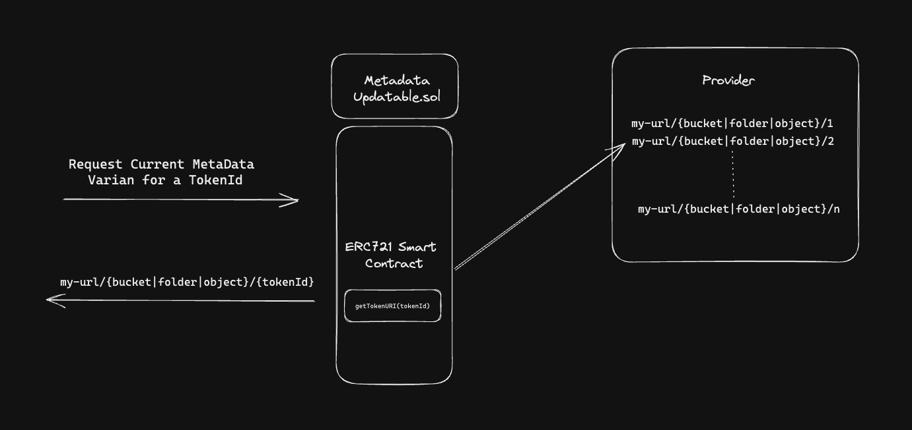

# Meta Data Updatable

This package will help ERC721 Smart contracts to easiliy handle metadata updates.

## Overview:

This system register a variant per each ```tokenId``` each ```tokenId``` can update its own metadata to anew available variant.




## Setup:


```shell
yarn add aurelianoa/metadataupdatable
npm install aurelianoa/metadataupdatable
pnpm install aurelianoa/metadataupdatable
```

In your ERC721 Solitidy Smart Contract:

```shell
import { MetadataUpdatable } from "@aurelianoa/metadataupdatable/contracts/MetadataUpdatable.sol";
```
Override the ```middleware``` function to do the proper authorization to the admin functions

```shell
function middleware() internal view override returns (bool)  {
        return msg.sender == _authorized;
}

/// OR

function middleware() internal view override onlyOwner returns (bool)  {
        return true;
}
```


## Usage:


```shell
function updateVariant(uint256 tokenId, string memory variant)

/// use getTokenURI on yous ERC721 tokenURI standar
function tokenURI(uint256 tokenId) public view override(ERC721A, IERC721A) returns (string memory) {
    require(_exists(tokenId), "Token does not exist");

    return getTokenURI(tokenId);
}
```
Then manage the variants and url metadata with the functions:

```shell
function setBaseURI(string calldata uri)
```
```shell
function setFileExtension(string memory _fileExtension)
```

```shell
function setVariant(string memory variant, string memory seed, uint256 price, bool active)
```

```shell
function setRevealedBaseURI(string calldata revealedBaseURI)
```

```shell
function setReveal(bool _isRevealed)
```

Note: you can add a price to each vartiant if you wan to ecourage "variant payable upgrades"

